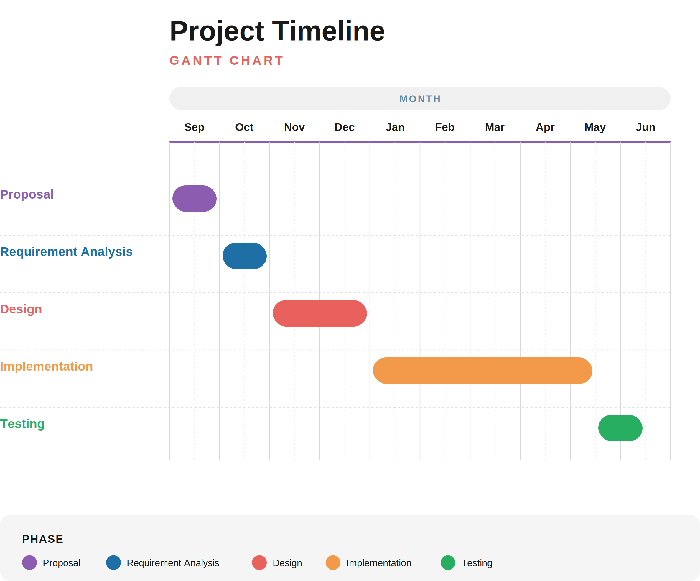

# Project Proposal: Handwritten Amharic Text Recognition Mobile Application

**Prepared by:**
- Eyob Nebyou — UGR/5588/16
- Hallelujah Ezra — UGR/4392/16
- Leawi Taddesse — UGR/4913/16

**Advisor:** Mr. Surafiel Habib
Department of Computer Science, College of Natural and Computational Sciences,
Addis Ababa University — 2026

---

## Chapter One: Introduction

### 1.1 Overview

Amharic is one of the major languages used in Ethiopia and is written using
the Ethiopic script. A large amount of information in Ethiopia is still
produced or preserved in handwritten form, including personal notes,
educational materials, administrative records, and other documents.
Converting handwritten information into digital text can make it easier to
edit, store, search, share, and preserve.

Optical Character Recognition (OCR) is the process of converting text
contained in an image into machine-readable text. Handwritten text
recognition is more difficult than printed-text recognition because
handwriting varies between writers in character shape, size, spacing,
alignment, and stroke patterns. These difficulties are particularly relevant
to handwritten Amharic because the system must distinguish visually related
Ethiopic characters and produce the correct sequence of digital text.

This project proposes a mobile application that allows a user to capture or
upload an image containing handwritten Amharic text, process the image
through a recognition model, apply an NLP-based correction step to reduce
recognition errors, and convert the result into an editable digital document.
The user will be able to review and correct the output and save or export the
resulting document.

The recognition component will be investigated and evaluated as part of the
research work, while the application will integrate the resulting recognition
and correction system into a usable mobile interface. The project's primary
recognition architecture will be a Convolutional Recurrent Neural Network
trained with Connectionist Temporal Classification (CRNN+CTC), with a
fine-tuned Transformer-based model (TrOCR) investigated as a secondary
comparison if time and computing resources allow.

### 1.2 Statement of the Problem

A significant amount of handwritten Amharic information is not readily
available as editable digital text. Manual transcription of handwritten
material can require considerable time and effort, particularly for
documents containing many lines or pages. A mobile tool that can
automatically recognize handwritten Amharic and produce editable digital
text could reduce this burden and support easier reuse and preservation.

Handwritten Amharic recognition presents technical challenges because of
variations in handwriting, visually similar characters, inconsistent
spacing, image quality, and other writing conditions. A recognition model
alone typically still produces character-level substitution, deletion, and
spacing errors; without a correction step and a convenient way to inspect
and fix the result, such a system has limited practical value for users.

This project therefore addresses the need for a mobile system that combines
handwritten Amharic recognition, an NLP-based correction step, and an
accessible editing and document-output workflow. The recognition component
will be tested systematically so that the application is based on measured
performance rather than an untested model.

### 1.3 Objective

This section presents the general objective of the project followed by the
specific objectives needed to achieve it.

#### 1.3.1 General Objective

To design and develop a mobile application that recognizes handwritten
Amharic text from images and converts it into editable digital documents.

#### 1.3.2 Specific Objectives

1. To review existing methods and prior work on handwritten Amharic and
   Ethiopic text recognition and identify an appropriate approach for the
   project.
2. To prepare and organize the Fidel handwritten Amharic dataset,
   supplemented as needed, for model development and evaluation.
3. To design and implement a handwritten Amharic text recognition model
   using a CRNN+CTC architecture as the primary approach, with a fine-tuned
   Transformer-based model (TrOCR) investigated as a comparison.
4. To train the selected model(s) and evaluate recognition performance using
   Character Error Rate (CER) and Word Error Rate (WER).
5. To identify and analyze common recognition errors, including character
   substitutions, deletions, insertions, spacing errors, and visually
   similar character confusions.
6. To design and implement an NLP-based post-processing correction module
   that reduces recognition errors identified in objective 5 using
   Amharic-specific language patterns.
7. To design and implement a mobile application that captures or accepts
   handwritten Amharic text images and sends them through the recognition
   and correction pipeline via a remote backend service.
8. To provide an editable text interface so users can review and correct
   the recognized and corrected Amharic text.
9. To provide functionality for saving or exporting corrected text as a
   digital document.
10. To test the integrated application against the defined functional and
    non-functional requirements.

### 1.4 Scope and Limitations of the Project

#### 1.4.1 Scope

- The system will focus on handwritten Amharic text.
- The application will accept handwritten text through a camera image or
  uploaded image.
- The recognition pipeline will convert the input image into digital
  Amharic text using a CRNN+CTC model, with a fine-tuned TrOCR model
  investigated as a comparison.
- An NLP-based correction module will post-process the recognized text to
  reduce common recognition errors.
- The recognized and corrected output will be displayed in an editable
  format.
- Users will be able to correct the recognized text before saving or
  exporting it.
- The project will include model evaluation and error analysis for the
  recognition component, using CER and WER.
- The project will include the design, implementation, integration, and
  testing of a mobile application with a remote recognition backend.
- The project will focus on text recognition and correction rather than
  complete document-layout analysis, handwriting authentication, or writer
  identification.

#### 1.4.2 Limitations

- Recognition performance may be affected by poor lighting, blur, low image
  resolution, distorted images, or unclear handwriting.
- The Fidel dataset, while the largest available, may not represent every
  handwriting style, writing instrument, or real-world document condition
  found in Ethiopia.
- The project will be limited by available computing resources and the time
  available for model training and experimentation.
- Because the recognition model is deployed on a remote server, the mobile
  application will require an internet connection to function.
- The NLP correction module will reduce, but is not expected to eliminate,
  all recognition errors.
- The project will not attempt to build a production-scale document
  management platform.

### 1.5 System Development Methodology

The system will be developed using an Agile approach. Development will be
divided into manageable iterations so that requirements, interface design,
recognition integration, testing, and improvements can be reviewed
throughout the project. This approach also allows the mobile application,
the recognition component, and the NLP correction module to be developed in
parallel and integrated as each becomes sufficiently stable.

#### 1.5.1 Investigation (Fact Finding) Methods

- Literature review will be used to understand handwritten text recognition
  methods, Amharic and Ethiopic OCR research, relevant datasets, and
  evaluation practices.
- Observation will be used to understand how users currently capture,
  transcribe, edit, and store handwritten Amharic text.
- Interviews or short questionnaires may be conducted with potential users
  to identify practical requirements and usability concerns.
- Analysis of existing applications will be used to identify useful
  features and limitations relevant to the proposed application.

#### 1.5.2 System Development Tools

- **Mobile application:** React Native will be used for cross-platform
  development, leveraging the team's existing React experience.
- **Machine learning:** Python with PyTorch will be used for CRNN+CTC model
  development, and Hugging Face Transformers will be used for fine-tuning
  the comparison TrOCR model.
- **Dataset:** the Fidel handwritten Amharic OCR dataset will be used for
  training and evaluation.
- **NLP correction:** an Amharic-specific correction approach (e.g. a
  character/word-level language model or dictionary-based edit-distance
  correction) will be developed to post-process recognition output.
- **Backend:** Python (e.g. FastAPI) will be used to host the recognition
  and correction pipeline as a remote service accessed by the mobile
  application.
- **Storage:** an appropriate cloud or database storage solution will be
  selected according to the final requirements.
- **Version control:** Git will be used for source-code management and
  collaboration.
- **Design and documentation:** diagramming and documentation tools will be
  used for system architecture, use cases, user flows, and technical
  documentation.
- **Testing:** unit, integration, and user-oriented testing will be used
  for the application, while recognition and correction will be evaluated
  with CER and WER.

### 1.6 Significance of the Project

The project aims to make handwritten Amharic information easier to digitize
and reuse. A working application could reduce manual transcription effort
and provide users with editable digital text that can be corrected, stored,
copied, and shared.

The project will also provide practical experience in computer vision,
handwritten text recognition, natural language processing, mobile
application development, system integration, and software testing. The
resulting system may provide a foundation for future work on Amharic
document processing and recognition.

### 1.7 Beneficiaries

- Students and educators who need to digitize handwritten notes and
  learning materials.
- Researchers who work with handwritten Amharic documents and require
  editable digital text.
- Organizations and offices that handle handwritten records suitable for
  digitization.
- Libraries, archives, and cultural institutions interested in preserving
  handwritten materials.
- General users who want to convert handwritten Amharic notes into
  editable digital documents.

### 1.8 Related Work

Research on Ethiopic and Amharic OCR has progressed from isolated-character
recognition toward full sentence-level, end-to-end models. Assabie and Bigun
(2011) produced an early dataset and recognition approach for offline
handwritten Amharic words, but at a limited scale. Belay et al. proposed
CNN-based models that leverage the grapheme structure of the Amharic
"Fidel-Gebeta" character table, and later end-to-end sequence models
progressing from LSTM-CTC to a blended Attention-CTC architecture evaluated
on the ADOCR dataset, which is composed mainly of printed and synthetic
text.

Belay et al. (2024) introduced HHD-Ethiopic, a large historical handwritten
Ethiopic dataset of roughly 80,000 text-line images, and established
CNN/Bi-LSTM/attention baselines evaluated with Character Error Rate (CER)
and Normalized Edit Distance; follow-up work using CNN-BiLSTM-attention
architectures reported CERs in the range of 18-30% on this dataset,
reflecting the difficulty of historical handwriting. Most recently, a
2025-2026 study introduced Fidel, the first large-scale sentence-level
Amharic OCR dataset spanning handwritten, typed, and synthetic text, with
40,000 handwritten and 28,000 typed line images from 411 native writers.
That work benchmarked seven deep-learning OCR architectures spanning CNN,
CTC, Transformer, and hybrid designs, with the best model reaching a CER of
2.64% and WER of 7.29%, establishing Fidel as the current state-of-the-art
benchmark for Amharic OCR and the most relevant dataset for a modern,
non-historical handwriting task such as this project.

Separately, Transformer-based OCR (TrOCR) has achieved strong results on
Latin-script handwritten and printed benchmarks by combining a pretrained
Vision Transformer encoder with an autoregressive text decoder, but adapting
it to other scripts is non-trivial: recent work adapting TrOCR to Tigrinya,
a closely related Ethiopic script, required specialized loss-weighting to
handle cross-script transfer. This motivates this project's choice of a
CRNN+CTC model as the primary, better-validated approach for Amharic, with a
fine-tuned TrOCR model investigated as a secondary comparison rather than
the primary plan.

### 1.9 Team Roles and Responsibilities

The project is carried out by a three-member team. Roles are divided
according to the three main components of the system, with collaboration
expected at integration points as described in the Agile methodology in
Section 1.5.

- **Hallelujah Ezra (UGR/4392/16)** — Computer vision and recognition
  model: dataset preparation, CRNN+CTC model design, training, and the
  TrOCR comparison model.
- **Eyob Nebyou (UGR/5588/16)** — NLP correction module: analysis of
  recognition error patterns and design and implementation of the
  Amharic-specific post-processing correction step.
- **Leawi Taddesse (UGR/4913/16)** — Mobile application, integration, and
  assistance on both the CV and NLP parts: capture/upload UI, editable text
  interface, export functionality, and integration with the remote
  recognition and correction backend.

All three members will collaborate on requirements gathering, system
testing, and documentation.

### 1.10 Time Schedule (Gantt Chart)

The proposed schedule follows the full project timeline, from the proposal
stage through final testing. Design work is planned to conclude around the
start of January, with implementation continuing through the following
months and testing concluding by mid-June. The schedule may be adjusted
based on department deadlines and will be aligned with the advisor's
confirmed dates for chapter submissions and final defense.

| Phase | Timeframe |
|---|---|
| Proposal | September |
| Requirement Analysis | October |
| Design | November – early January |
| Implementation | January – early May |
| Testing | May – mid-June |

The schedule may be adjusted after the initial requirements and dataset
assessment. Any changes will be documented in the project record.

## References

- Assabie, Y., & Bigun, J. (2011). Offline handwritten Amharic word
  recognition. *Pattern Recognition Letters*, 32(8), 1089-1099.
- Belay, B. H., Guyon, I., Mengiste, T., Tilahun, B., Liwicki, M., Tegegne,
  T., & Egele, R. (2024). HHD-Ethiopic: A Historical Handwritten Dataset
  for Ethiopic OCR with Baseline Models and Human-Level Performance. In
  *International Conference on Document Analysis and Recognition (ICDAR)*,
  pp. 23-38. Springer.
- Abdurahman, F., Sisay, E., & Fante, K. A. (2021). AHWR-Net: Offline
  handwritten Amharic word recognition using convolutional recurrent
  neural network. *SN Applied Sciences*.
- Fidel: A Large-Scale Sentence Level Amharic OCR Dataset (2025-2026).
  *International Journal on Document Analysis and Recognition (IJDAR)*,
  Springer Nature.
- Li, M., Lv, T., Cui, L., Lu, Y., Florencio, D., Zhang, C., Li, Z., & Wei,
  F. (2021). TrOCR: Transformer-based Optical Character Recognition with
  Pre-trained Models. arXiv:2109.10282.
- Adapting TrOCR for Printed Tigrinya Text Recognition: Word-Aware Loss
  Weighting for Cross-Script Transfer Learning (2026). arXiv:2604.20813.
- Graves, A., Fernandez, S., Gomez, F., & Schmidhuber, J. (2006).
  Connectionist Temporal Classification: Labelling unsegmented sequence
  data with recurrent neural networks. In *Proceedings of the 23rd
  International Conference on Machine Learning (ICML)*, pp. 369-376.
